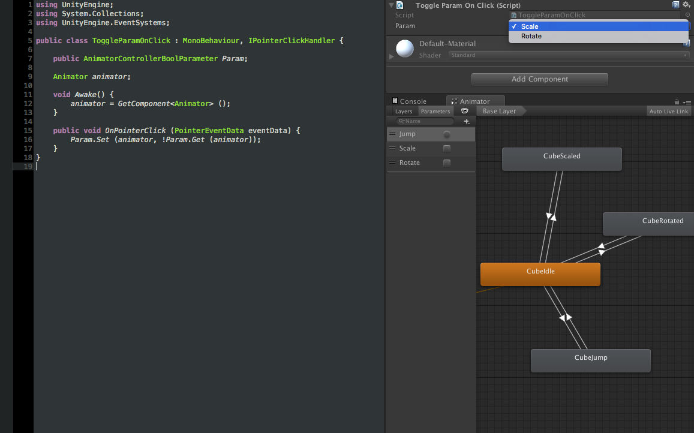

# Animator Controller Parameter Picker

Tired of having to write glue code to convert your animator's parameter names to hashes to speed up your game and prevent unnecessary allocs?

With this picker you can just add a public property to your scripts and then you'll get a dropdown list of all the matching parameters for the attached animator. 

On top of that, there are three types of animator parameter classes (Bool, Float and Trigger) to prevent you from making common errors such as trying to call a `SetBool` on a `Trigger` param.

